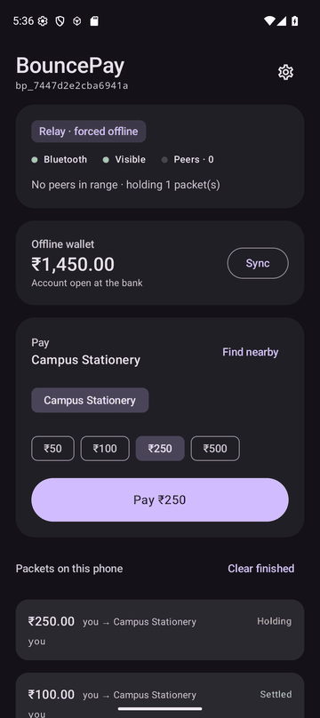
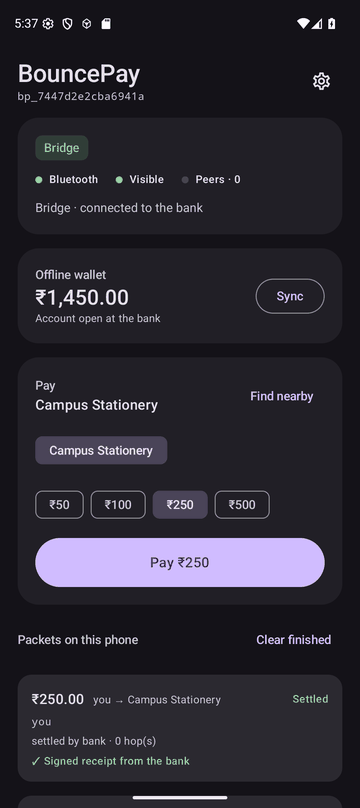

# BouncePay for Android

The phone side of BouncePay: sign a payment with no internet, and let it hop
over Bluetooth Low Energy through nearby phones until one of them can reach
the bank.

Every phone runs the same code and plays whichever part its situation calls
for. Nothing is configured as a "relay" or a "bridge".

| The phone can… | So it… |
| --- | --- |
| reach the bank | is a **bridge**: settles everything it holds |
| not reach the bank | is a **relay**: hands packets to nearby phones, carries others' |
| do nothing yet | advertises, so others can hand it packets |

<table>
<tr>
<td></td>
<td></td>
</tr>
<tr>
<td>Paid while offline — signed, held, wallet debited</td>
<td>Back online — settled, with the bank's signed receipt</td>
</tr>
</table>

## Build

Requires JDK 17 and the Android SDK (platform 36). Gradle is fetched by the
wrapper, pinned to a verified checksum.

```bash
./gradlew assembleDebug        # → app/build/outputs/apk/debug/app-debug.apk
./gradlew testDebugUnitTest    # also writes the packet the bank's interop test verifies
adb install -r app/build/outputs/apk/debug/app-debug.apk
```

Or open this folder in Android Studio.

Android 8.0+ (API 26). The phone needs BLE peripheral mode (advertising); most
phones from the last several years have it. Test the mesh on real phones — the
emulator's virtual Bluetooth says nothing about range or radio behaviour.

## Demo: three phones, one laptop

1. On the laptop: `cd ../mock-bank && npm start`. Open
   `http://localhost:4000` for the dashboard and note the LAN URL it prints.
2. Install the app on three phones and grant Bluetooth (and notifications).
3. On **each** phone, while it is online: **Settings → Bank URL** → the LAN
   URL, then **Load** on the wallet card. This opens the phone's account at
   the bank and loads ₹2,000 of offline spending.
4. Place them in a line, each within Bluetooth range of the next only:
   - **A — payer**: Settings → **Force offline** on
   - **B — relay**: Force offline on
   - **C — bridge**: Force offline off, on the laptop's Wi-Fi
5. On A, tap **Pay**. Watch the packet go A → B → C and land on the
   dashboard with its route; a moment later A shows it settled, with the
   bank's receipt, while still offline.
6. To pay a person instead of the merchant: on A, **Find nearby**, pick B,
   pay. B shows it under *Received* at once, and confirmed once the receipt
   comes back from C.

*Force offline* is more dependable than airplane mode, which switches
Bluetooth off on many phones.

Without a laptop, a bridge with *On-device fallback bank* enabled settles
locally and labels it so. The wallet can then be loaded on-device too — a real
bank would refuse those later, which is correct.

## How it works

```
Pay  ─►  Packet.create  ─►  PacketStore  ─►  MeshNode loop (every 6 s, or on demand)
          (sign in Keystore)  (on disk)        ├─ bank reachable?  → RemoteBank.settle
                                               ├─ network, no bank → EmbeddedBank (if allowed)
                                               └─ otherwise        → MeshCentral: scan, connect, write
                                          MeshPeripheral: advertise, accept writes ─► PacketStore
```

| File | Role |
| --- | --- |
| `crypto/DeviceKey.kt` | P-256 key in Android Keystore; never leaves the device. Account id = `bp_` + first 8 bytes of SHA-256(public key) |
| `model/Packet.kt` | Signed payload (opaque string, never re-serialised) + unsigned hop list |
| `store/PacketStore.kt` | Store-and-forward queue, written atomically to disk on every change |
| `store/AppPrefs.kt` | Bank URL, force-offline, fallback, offline wallet, display name, pinned bank key |
| `store/IncomingLedger.kt` | Bank-proven payments to this phone, each credited once |
| `ble/BleIds.kt` | Service/characteristic UUIDs and chunk framing |
| `ble/MeshPeripheral.kt` | GATT server + advertiser: receives packets |
| `ble/MeshCentral.kt` | Scanner + GATT client: sends packets, one awaited operation at a time |
| `bank/Bank.kt` | `RemoteBank` (the mock bank over HTTP) and `EmbeddedBank` (same rules, on-device) |
| `mesh/MeshNode.kt` | The loop: owns the radio and network, decides bridge or relay every cycle |
| `mesh/MeshRouter.kt` | Every routing decision — what to accept, settle, forward, and believe — with no Android dependency |
| `mesh/ReceiptBook.kt` | Which bank receipts to pass on, and to whom they have been sent |
| `model/Receipt.kt` | A bank-signed receipt and its BLE batch encoding |
| `mesh/MeshService.kt` | Foreground service so relaying continues with the screen off |

### Over the air

Each phone advertises service `b0cce000-9a11-4e6d-9f2c-000000000001` and
exposes two characteristics:

- `…0002` **write** — the packet, split into chunks framed as
  `[index u16][count u16][bytes]`, since a packet (~800 bytes) exceeds even a
  517-byte MTU.
- `…0003` **read** — the phone's profile, `{"id":"bp_…","name":"…"}`. A
  sender reads it first and skips any phone already in the packet's hop list,
  so a packet never ping-pongs between two phones in range of each other. The
  name is what appears in other phones' payee list.
- `…0004` **write** — a batch of bank-signed receipts, chunked the same way.

One connection per neighbour carries everything it still needs: packets it
has not carried, and receipts it has not been sent.

A hand-off records the receiving phone in the hop list, so each packet goes
to each neighbour once — every neighbour, since a copy per route finds the
bridge fastest. If several copies reach the bank, it settles one and answers
the rest with the same receipt.

### Getting the answer back to the payer

The payer is usually still offline when its payment settles. So the bridge
takes the bank's **signed receipt** and passes it back through the mesh the
same way packets travel forward: each phone offers each fresh receipt to each
neighbour once, for ten minutes.

Every phone pins the bank's public key whenever it reaches the bank, and
marks a payment settled only if the receipt verifies against that key. A
relay can carry a receipt; it cannot invent one. A phone that has never met
the bank carries receipts on without acting on them.

In the three-phone demo, A flips from *Handed on* to *Settled* with
"✓ Signed receipt from the bank" shortly after C settles, while A is
still forced offline. The on-device fallback bank issues no signed receipts,
so its settlements are not passed back.

### Paying a phone next to you

Any BouncePay phone in range can be paid, not just the merchant. **Find
nearby** lists phones by the name set in Settings; phones met while relaying
appear there too. The payment travels like any other — usually through the
payee's own phone first, since it is the nearest — and the bank opens the
payee's account on first settlement if it has none.

The payee sees it straight away under **Received** as *waiting for the bank*,
because it is holding the signed packet. It becomes *✓ Confirmed*, and is
added to the payee's offline wallet, only when the bank's signed receipt
reaches it — once, however many neighbours pass the same receipt on. A packet
alone proves nothing about whether the payer can pay; the receipt does.

### Guard rails on the phone

- **Offline wallet**: the app will not sign beyond what was loaded while
  online. When the phone later sees the bank refuse one of its payments (it
  resubmits its own packets once it is a bridge), the amount is returned.
- **₹2,000 ceiling** per packet, mirrored by the bank.
- **Scan throttle**: Android silently ignores apps that start more than five
  scans in 30 s, so scans are spaced at least 6.5 s apart.

## Testing the mesh without phones

`MeshSimulationTest` wires several real `MeshRouter`s, each over its own
on-disk queue, into a topology and runs pump cycles, replacing only Bluetooth.
Keys are real P-256 and the fake bank verifies and signs like the mock bank.
It checks that:

- a payment crosses two relays, settles once, and the offline payer receives
  the bank's receipt;
- copies that reach two bridges move the money once;
- two phones out of reach of any bridge pass a packet once, not back and forth;
- a relay cannot forge a receipt, and a relay that never met the bank carries
  receipts without acting on them;
- a refused payment returns to the payer's wallet, and nothing is lost while
  the bank is down;
- on a 4×4 grid the payment gets from one corner to a bridge in the other,
  with each phone passing it to each neighbour at most once;
- a phone paid by its neighbour holds the payment at once and is credited
  exactly once when the receipt arrives by two routes, and a forged receipt
  credits nothing.

Disabling the loop check or the receipt verification in `MeshRouter` makes
these tests fail — they were checked that way.

`RemoteBankIntegrationTest` starts the real mock bank (`node src/server.js`)
on a free port and drives it with `RemoteBank`, the code a bridge phone runs:
enrolment, settlement with a verifiable proof, duplicates, refusal codes, and
an absent bank. It is skipped where Node is not installed.

## Run on an emulator

Screenshots above are from the app running on the Android 16 (API 36)
emulator against the real mock bank on the same machine, which the emulator
reaches as `http://10.0.2.2:4000`. That run exercised: permissions and the
foreground service; the GATT server and advertising starting; enrolment;
Keystore-signed payments verified and settled by the Node bank; a payment
made under *Force offline* being held, then settling by itself when the
phone came back online; and the signed receipt appearing on each payment.

## Status

- **Tested on the JVM** (37 tests, run in CI on every push): chunking, UUIDs,
  the packet envelope, bank-signed receipts, the mesh simulation above, a
  JVM-signed packet that the Node bank verifies byte-for-byte, and — in four
  of them — the phone's bank client against the real Node bank over HTTP.
- **Run on an emulator** against the real bank: Keystore signing,
  enrolment, settlement, store-and-forward and receipts.
- **Not yet tried**: phone-to-phone transfer over Bluetooth on physical
  handsets. That needs two or more of them, and is the next thing to do.
